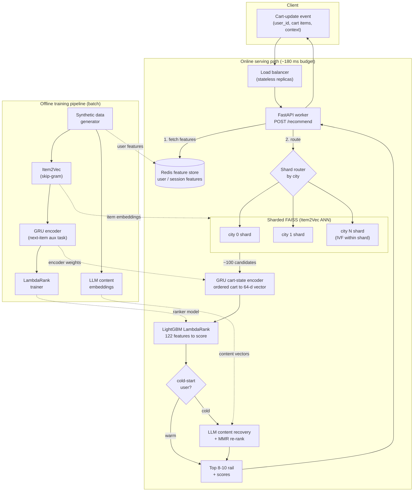

# System Design — CSAO Rail Recommendation Service

Real-time system that returns a ranked rail of 8–10 add-on items on every
cart-update event, within a 200–300 ms SLA, at food-delivery scale.

## Architecture

## Request lifecycle

| # | Step | Component | Typical cost |
|---|------|-----------|-------------:|
| 1 | Pull cached user/session features | Redis feature store | ~1 ms |
| 2 | Route to the user's city shard, pull ~100 candidates | Sharded FAISS (Item2Vec ANN) | <1 ms |
| 3 | Encode the ordered cart into the cart-state vector | GRU encoder (PyTorch) | ~2–4 ms |
| 3 | Build feature rows + score candidates | LightGBM LambdaRank | ~2–4 ms |
| 4 | Cold-start only: content recovery + MMR diversity | LLM content signal + MMR | ~1–2 ms |
| 5 | Return top-8–10 ranked rail | FastAPI | ~1 ms |

Single-request end-to-end compute is **~7–12 ms**; see
[latency_benchmark.md](../outputs/latency_benchmark.md) for the full
latency-vs-concurrency curve.

## FAISS sharding strategy

- **Primary shard key: city.** Each city gets its own ANN index holding only that
  city's items (~1.9K of the 15K today). CSAO add-ons come from the same
  restaurant/city as the cart, so routing to one shard preserves recall while
  keeping each search over a small index.
- **Within-shard scaling: IVF.** Once a shard exceeds ~20K items the index
  switches from exact `IndexFlatIP` to `IndexIVFFlat` (coarse-quantised,
  `nprobe` tuned), making search sub-linear.
- **Scaling to millions of items:** add a second shard dimension —
  `city x item-cluster` (k-means over Item2Vec) or `city x cuisine` — so no single
  index grows unbounded. Shards are independent and can live on separate hosts.
- **Throughput:** serving workers are **stateless** (all state in Redis + the
  read-only FAISS/model artifacts), so throughput scales by replicating workers
  behind the load balancer; latency under load is bounded by per-worker GIL, not
  the ANN search.

## Cold-start routing

A newly-listed item has no curated metadata and no interaction history, so the
collaborative ranker is blind to it. For **cold-start users** the service masks the
new item's structured + collaborative features and recovers its role from the LLM
**content embedding** (content-inferred complementarity), then applies **MMR** for
diversity. Warm users skip this path entirely (the collaborative ranker already
handles them). See [coldstart_results.md](coldstart_results.md).

## Data freshness

- **User/session features** (Redis): refreshed on session events / periodic
  batch; the online store mirrors the offline feature tables.
- **Item2Vec / GRU / ranker** (artifacts): retrained offline on a schedule and
  hot-swapped into workers.
- **Content embeddings** (LLM): computed once per item at listing time from its
  description — no interaction history required, which is what makes them the
  cold-start fallback.
